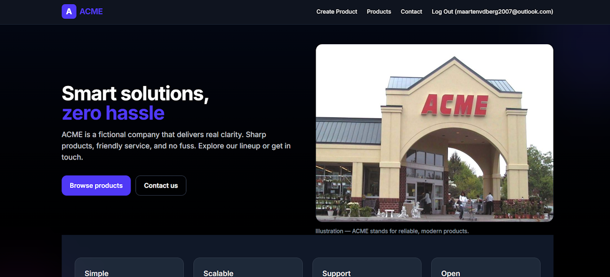

# Fake Store — ACME



Een full-stack webshop applicatie gebouwd met Next.js, inclusief CRUD-functionaliteiten, authenticatie en een Supabase backend.  
Dit project laat mijn vaardigheden zien op het gebied van full-stack webdevelopment en database-integratie.  
Het project is ontwikkeld als onderdeel van mijn HBO-ICT opleiding.

---

## Live Demo

- Live Website: [https://fake-store-acme.vercel.app](https://fake-store-acme.vercel.app/)  
- GitHub Repository: [https://github.com/Maarten0162/FakeStoreACME](https://github.com/Maarten0162/FakeStoreACME)

---

## Overzicht

Het Fake Store project is gemaakt om:

- Full-stack development vaardigheden te demonstreren  
- Te werken met Supabase authenticatie en database  
- CRUD-operaties te implementeren met correcte toegangsrechten  
- Een externe API te integreren  
- Een moderne en responsive webshop interface te bouwen  

De applicatie is gebaseerd op een fictieve ACME store.  
Producten worden in eerste instantie opgehaald via de FakeStoreAPI en kunnen vervolgens worden beheerd door ingelogde gebruikers via een eigen interface.

---

## Functionaliteiten

### Authenticatie (Supabase)
Authenticatie wordt afgehandeld met Supabase Auth, waarmee gebruikers kunnen:

- Registreren met e-mail en wachtwoord  
- Inloggen en uitloggen  
- Toegang krijgen tot beveiligde functionaliteiten  

Alleen ingelogde gebruikers kunnen producten aanmaken, aanpassen of verwijderen.

---

### CRUD Functionaliteit (Producten)

| Operatie | Toegang |
|--------|--------|
| Producten bekijken | Openbaar (alle gebruikers) |
| Product aanmaken | Alleen ingelogde gebruikers |
| Product aanpassen | Alleen ingelogde gebruikers |
| Product verwijderen | Alleen ingelogde gebruikers |

Dit zorgt voor correcte autorisatie en veilige dataverwerking.

---

### Externe API Integratie
Producten worden geïmporteerd via de [FakeStoreAPI](https://fakestoreapi.com/).  
Deze producten worden vervolgens opgeslagen en beheerd binnen de Supabase database, waardoor volledige CRUD-functionaliteit mogelijk is.

---

### Modern & Responsive
De applicatie is gebouwd met moderne tools en best practices:

- Responsive design  
- Strakke UI met Tailwind CSS  
- Server-side rendering met Next.js  
- Modulaire componentstructuur  

---

## Gebruikte Technologieën

- Framework: Next.js 15.5.9  
- Taal: TypeScript ^5  
- Styling: Tailwind CSS ^4  
- Database & Authenticatie: Supabase (supabase-js ^2.58.0)  
- Auth UI: @supabase/auth-ui-react ^0.4.7  
- Externe API: FakeStoreAPI

---

## Geïnstalleerde Packages

- Supabase  
- Supabase Auth UI React  
- Tailwind CSS  
- ESLint  

---

## Bestandsstructuur

```txt
FakeStoreACME/
├── _lib/
│   ├── scripts.ts
│   └── SupabaseClient.ts
├── .gitattributes
├── .gitignore
├── app/
│   ├── _lib/
│   │   └── SupabaseClient.ts
│   ├── api/
│   │   └── products/
│   │       ├── [id]/
│   │       │   ├── edit/
│   │       │   │   └── route.ts
│   │       │   └── route.ts
│   │       └── route.ts
│   ├── commands/
│   │   ├── createitem.tsx
│   │   └── importitems.tsx
│   ├── components/
│   │   ├── DeleteButton.tsx
│   │   ├── EditButton.tsx
│   │   ├── Footer.tsx
│   │   ├── Header.tsx
│   │   ├── Login.tsx
│   │   └── NoProduct.tsx
│   ├── contact/
│   │   └── page.tsx
│   ├── createproduct/
│   │   └── page.tsx
│   ├── favicon.ico
│   ├── fonts.ts
│   ├── globals.css
│   ├── layout.tsx
│   ├── login/
│   │   └── page.tsx
│   ├── not-found.tsx
│   ├── page.tsx
│   └── products/
│       ├── [productId]/
│       │   ├── edit/
│       │   │   └── page.tsx
│       │   └── page.tsx
│       └── page.tsx
├── eslint.config.mjs
├── next.config.js
├── next.config.ts
├── package-lock.json
├── package.json
├── postcss.config.mjs
├── public/
│   └── shop.jpg
├── README.md
├── tailwind.config.js
├── tsconfig.json
└── types/
    └── product.ts

```

```bash
# Clone de repository
git clone https://github.com/Maarten0162/FakeStoreACME.git

# Ga naar de projectmap
cd FakeStoreACME

# Installeer dependencies
npm install

# Start de development server
npm run dev
```

## License
MIT License

Copyright (c) 2025 Maarten van den Berg

Permission is hereby granted, free of charge, to any person obtaining a copy
of this software and associated documentation files (the "Software"), to deal
in the Software without restriction, including without limitation the rights
to use, copy, modify, merge, publish, distribute, sublicense, and/or sell
copies of the Software, and to permit persons to whom the Software is
furnished to do so, subject to the following conditions:

The above copyright notice and this permission notice shall be included in all
copies or substantial portions of the Software.

THE SOFTWARE IS PROVIDED "AS IS", WITHOUT WARRANTY OF ANY KIND, EXPRESS OR
IMPLIED, INCLUDING BUT NOT LIMITED TO THE WARRANTIES OF MERCHANTABILITY,
FITNESS FOR A PARTICULAR PURPOSE AND NONINFRINGEMENT. IN NO EVENT SHALL THE
AUTHORS OR COPYRIGHT HOLDERS BE LIABLE FOR ANY CLAIM, DAMAGES OR OTHER
LIABILITY, WHETHER IN AN ACTION OF CONTRACT, TORT OR OTHERWISE, ARISING FROM,
OUT OF OR IN CONNECTION WITH THE SOFTWARE OR THE USE OR OTHER DEALINGS IN THE
SOFTWARE.
